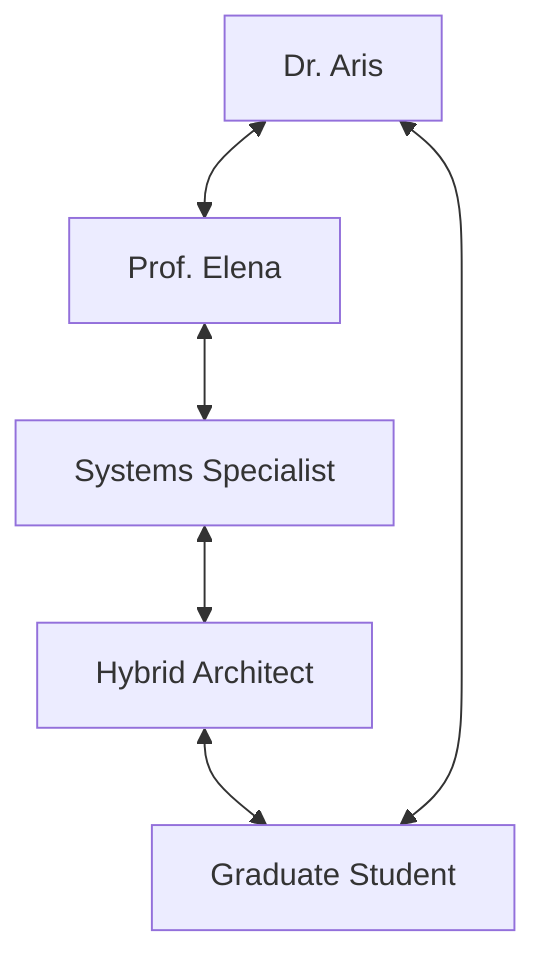

# Task 1 — Directed Agent Communication Graph

## Required outcome

Each participating Week 2 agent is a node. Each edge is directed: an edge from
`A` to `B` permits A's message to be delivered directly to B. The graph must be
strongly connected, inspectable, reproducible, and usable for routing.

## Implemented files

- `week3/agent_graph.py`: immutable graph, JSON loading, validation, neighbor
  lookup, and strong-connectivity test.
- `configs/agent_graph.json`: the chosen five-agent topology.
- `tests/week3/test_agent_graph.py`: acceptance and invalid-configuration tests.

## Selected topology

The graph is a five-node ring with each neighboring relationship represented in
both directions. It has ten explicit directed edges.



This design gives each participant two direct contacts and prevents automatic
broadcasting. It also lets information originating at any agent reach every
other agent in at most two hops.

## Why the strong-connectivity check is correct

For a directed graph, visiting every node from one starting node is not enough.
The implementation performs two traversals:

1. Traverse the original edges from a starting agent. This checks that the
   starting agent can reach every node.
2. Reverse every edge and traverse again. This checks that every node can reach
   the starting agent in the original graph.

Both conditions together prove that every ordered pair of agents has a directed
path. Invalid nodes, duplicate edges, self-edges, and disconnected topologies
are rejected before the discussion starts.

## Public interface

```python
graph = AgentGraph.from_json("configs/agent_graph.json")
graph.validate()
graph.validate_participants(participant_ids)
graph.is_strongly_connected()
graph.recipients("dr_aris")
graph.senders("dr_aris")
graph.has_edge("dr_aris", "prof_elena")
```

`recipients(sender)` is the routing direction used by the orchestrator. The
order in the JSON file is retained so runs can be inspected consistently.

## Acceptance evidence

Run:

```bash
python -m pytest tests/week3/test_agent_graph.py -q
```

The tests prove that the supplied topology is strongly connected, a one-way
chain is rejected, invalid edges are rejected, configuration round-trips are
reproducible, and removing one edge prevents that direct route.
