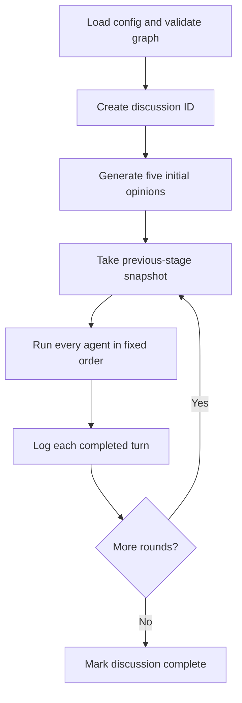

# Task 2 — Discussion Orchestration Engine

## Required outcome

The orchestrator controls the discussion's lifecycle: run identity, participant
order, initial opinions, rounds, agent invocation, visible messages, retrieval
hook, logging hook, opinion updates, failure handling, and termination.

## Implemented files

- `week3/orchestrator.py`: the central controller.
- `week3/models.py`: shared discussion and turn records.
- `week3/interfaces.py`: replaceable runtime, retrieval, and event boundaries.
- `week3/week2_adapter.py`: bridge to the merged Week 2 LangGraph agents.
- `week3/run_log.py`: immediate JSONL event logging for Task 2 evidence.
- `week3/fakes.py`: predictable local runtime requiring no credentials.
- `week3/demo.py`: runnable fake or live demonstration.
- `tests/week3/test_orchestrator.py`: scheduling, context, logging, and failure tests.
- `tests/week3/test_week2_adapter.py`: verifies the Week 2 bridge contract.

## Execution sequence



Initial opinions are stage 0. They do not count as one of the three required
discussion rounds. Round 1 sees routed initial opinions; Round 2 sees routed
Round 1 responses; Round 3 sees routed Round 2 responses.

## Scheduling decision

Agents execute sequentially in the order listed in `configs/discussion.json`.
Every round uses a frozen snapshot of the preceding stage. Therefore an agent
executed near the end of Round 2 cannot see another agent's Round 2 response
until Round 3. This avoids order-dependent information leakage.

## Week 2 integration

`Week2AgentRuntime` compiles one Week 2 agent graph and keeps its checkpointer
alive for the complete discussion. Each agent uses a stable thread identifier:

```text
<discussion_id>:<agent_id>
```

The adapter loads the existing persona and supplies the structured brief,
previous opinion, graph-routed neighbor messages, retrieval query, and evidence.
It returns plain records containing the response, opinion, evidence, retrieval
queries, and runtime metadata.

## Retrieval and storage boundaries

Tasks 5-7 are separate team tasks. The orchestrator already defines where they
connect:

- A `RetrievalProvider` builds a query and returns evidence immediately before
  an agent turn.
- An `EventSink` receives the start event, every completed turn, completion, or
  failure.

The included fake demo uses no retrieval provider and writes an append-only
JSONL execution log. The Task 5 provider should perform a retrieval call for
every agent in every discussion round. The Task 6/7 implementation should
persist these events to PostgreSQL and record opinion history.

## Failure behavior

If graph validation, retrieval, agent execution, or event writing fails, the
run is marked failed. `DiscussionExecutionError.partial_result` retains every
turn that completed before the failure. A failure event is attempted without
hiding the original exception.

## Acceptance evidence

Run the credential-free demonstration:

```bash
python -m week3.demo --mode fake
```

It reports a strongly connected graph, five initial opinions, three rounds,
and fifteen discussion turns. Inspect the printed file under `outputs/week3/`.
Every line is one event, and every agent has one logged response per round.

Run tests:

```bash
python -m pytest tests/week3/test_orchestrator.py tests/week3/test_week2_adapter.py -q
```
